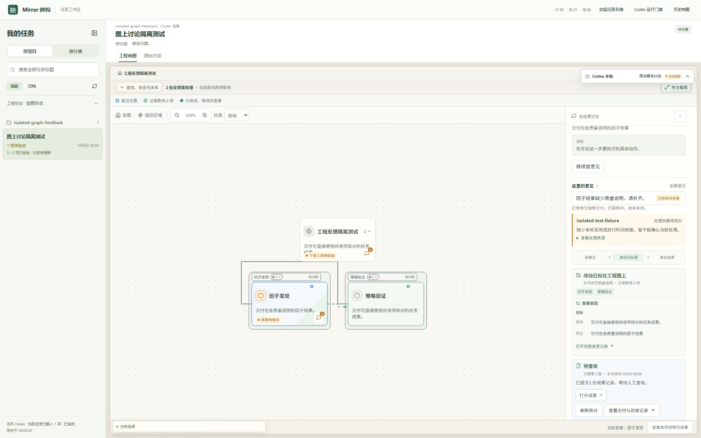

# SpecMirror · review the result where the question began

**A local engineering workbench for seeing a scoped request, its exact run, the source changes and the result at the original project node.** An agent may submit work; a person must decide whether to accept it.

[](assets/review-at-origin.png)

[Watch the actual UI test recording](assets/review-at-origin.webm) · [Read the evidence and limits](docs/review-at-origin.md)

The screenshot and recording are from an **isolated React/Playwright fixture** with invented project content and intercepted API responses. A separate isolated HTTP test runs the real service routes, writes a real local source change, checks it, and links the exact result to the feedback. The UI recording is not a production human acceptance receipt.

## Run locally

Requires Node.js 24+ and pnpm 10.33.2.

```bash
pnpm install --frozen-lockfile
pnpm dev
```

Open `http://127.0.0.1:5173/`. The API is served at `http://127.0.0.1:4317/` in **mock gateway** mode. The included `.project/` is a fictional empty workspace; it contains no private engineering history. Normal write and acceptance actions retain the app's real human authentication boundary. The isolated tests inject explicitly labeled test identities inside temporary servers; they do not enable approval in the running app.

To reproduce the published evidence:

```bash
pnpm --filter @epm/orchestrator build
pnpm --filter @epm/web build
pnpm exec vitest run apps/orchestrator/test-fixtures/graph-feedback-loop.test.ts apps/web/src/components/project-map/feedback-execution.test.ts apps/web/src/components/project-map/feedback-comparison.test.ts
pnpm exec playwright install chromium
pnpm exec playwright test --config tests/e2e/graph-feedback.playwright.config.ts --project graph-feedback-desktop -g "recorded changes, exact impact"
pnpm exec playwright test --config tests/e2e/graph-feedback.playwright.config.ts --project graph-feedback-desktop -g "delayed results cannot replace another selection"
```

## The review path

1. **Locate the opinion.** Feedback targets an exact node or a field/output inside it, with the document and node revisions recorded at creation.
2. **Freeze the work.** A run carries a snapshot of the node, contract key, lineage and allowed source scope.
3. **Inspect execution.** Source proof compares before and after files and checks the configured commands. A passing agent report alone is insufficient.
4. **Return to the same opinion.** `submitted_run_id` points to that feedback item’s submitted run. The view refuses a run from another node and does not substitute the node’s latest run.
5. **Review deliberately.** The result remains pending until an authenticated human review occurs. If source changes after checking, closure is blocked and the opinion stays open for review.

This release retains the real source modules in `packages/domain/`, `packages/spec-io/`, `apps/orchestrator/` and `apps/web/`. It is a selected copy from the local `Engine_Process_Manage` implementation. `Mirror` is an entry/evidence workspace in the original environment, not a second product copied here. The public `.project/` data is a new fictional fixture.

### Design choices

| Constraint | Choice and cost | Evidence |
| --- | --- | --- |
| A later run can belong to the same node but a different opinion. | Bind feedback to `submitted_run_id`, node and frozen contract. A missing or old link is shown as uncertain or historical instead of guessed. | `packages/domain/src/engineering-feedback.ts`, `apps/web/src/components/project-map/feedback-execution.ts` and `feedback-comparison.ts`; isolated service and UI tests. |
| An Agent report can omit or overstate source changes. | Check actual source differences and allowed paths before a run can be reviewed. This requires a local source checkout. | `apps/orchestrator/src/engineering-source-proof.ts`; `graph-feedback-loop.test.ts`. |
| Human authority cannot be inferred from a browser session or Agent header. | Keep approval routes behind authenticated human approval; isolated tests provide separate test identities. | `apps/orchestrator/src/human-approval.ts`; rejection tests in `graph-feedback-loop.test.ts`. |
| A slow response may arrive after the reviewer switches nodes. | Tie result reads to the selected workspace, node, run and contract; ignore stale responses. | `tests/e2e/graph-feedback.spec.ts`. |

**Evidence ceiling:** the public slice demonstrates a working local app, a source-backed isolated service loop and an isolated UI review path. It does **not** show a real person accepting the published fixture, an autonomous multi-agent completion, or feedback becoming a verified Jervis capability. SpecMirror’s current execution path uses its own Codex App Server/Companion integration; this release does not route work through the separate [SuperLocal Harness](https://github.com/Cornelius-Chen/SuperLocal-Harness).

No open-source license has been selected for this public source release.
