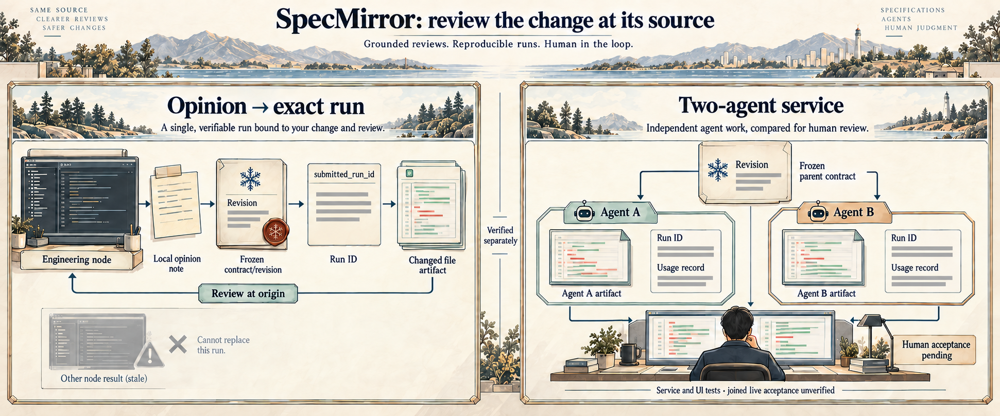

# Two scoped agents, two reviewable results

## Engineering question

How can a project detail become two independently scoped work items whose artifacts, timing and resource use can be inspected and accepted without allowing one agent to overwrite the other's area?

The illustration places the feedback/UI and dual-agent service tests side by side. Their separate tests do not prove a combined autonomous path. [Editable technical map](../assets/dual-agent-review-loop.svg).

## Implemented mechanism

The [dual-agent service test](../apps/orchestrator/src/engineering-dual-agent-closed-loop.test.ts) creates a fictional project with two task zones and two leaf results. Each leaf has an owner, output path, acceptance criterion and delivery scope. It dispatches both leaves as external runs, verifies queued handoffs, claims each with its own identity and frozen contract key, then executes two artifact actions concurrently. Both runs enter `review`. Explicit review calls accept each artifact. The test checks token deltas for each session, overlapping run times, persisted artifact files, and accepted records after service restart.

The sessions, token snapshots, artifact content and acceptance calls are **injected test inputs**. This demonstrates orchestration, isolation and persistence in the real service code; it does not show two autonomous model workers completing a live user request or a real person approving these exact outputs.

## Exact feedback binding is a separate path

The [feedback service test](../apps/orchestrator/test-fixtures/graph-feedback-loop.test.ts) checks a real source change and links its exact `submitted_run_id` to the original opinion. The [UI test](../tests/e2e/graph-feedback.spec.ts) displays that opinion, impact and linked result in the engineering graph using intercepted fixture responses. A later run for the same node cannot silently replace the selected result. The screenshot and short final-state clip in [review at origin](review-at-origin.md) show this isolated interface path.

## Changeable details and current limit

The graph can target a node, field or output and show affected work. A run freezes the selected node contract and source scope so a later edit does not silently redefine work already claimed. The public tests prove both the two-run mechanics and exact feedback-to-run binding **separately**. A single continuous run from a person's graph edit through two live model workers, integration and authenticated human acceptance remains a research milestone.
